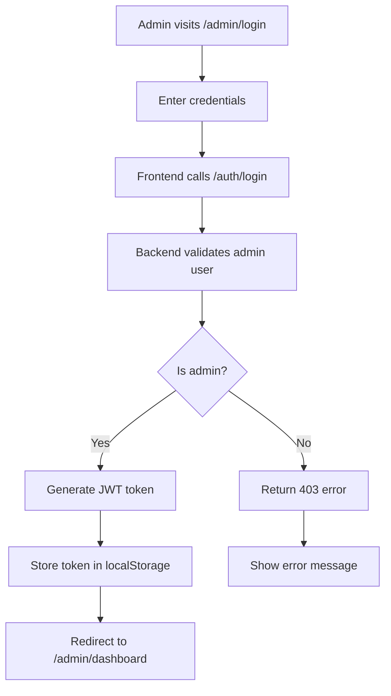

# 👑 LawVriksh Admin Flow Complete Guide

## Overview

Complete guide for the LawVriksh admin system, covering authentication, dashboard, user management, analytics, and all admin features.

**Admin Access:**
- **Login URL**: `https://lawvriksh.com/admin/login`
- **Dashboard**: `https://lawvriksh.com/admin/dashboard`
- **Credentials**: `sahilsaurav2507@gmail.com` / `Sahil@123`

## 🔐 Admin Authentication Flow

### 1. Admin Login Process



### 2. Authentication Components

#### **Frontend (`AdminLogin.tsx`)**
```typescript
const handleSubmit = async (e: React.FormEvent) => {
  const success = await login(email, password);
  if (success) {
    navigate('/admin/dashboard');
  } else {
    setError('Invalid admin credentials');
  }
};
```

#### **Backend (`app/api/admin.py`)**
```python
@router.post("/login")
def admin_login(user_in: UserLogin, db: Session = Depends(get_db)):
    user = authenticate_user(db, user_in.email, user_in.password)
    if not user or not user.is_admin:
        raise HTTPException(status_code=403, detail="Admin credentials required")
    token = create_jwt_for_user(user)
    return {"access_token": token, "token_type": "bearer", "expires_in": 3600}
```

### 3. Protected Routes

#### **Route Protection (`ProtectedRoute.tsx`)**
```typescript
const ProtectedRoute: React.FC<ProtectedRouteProps> = ({ 
  children, 
  requireAdmin = false 
}) => {
  const { isAuthenticated, isAdmin, loading } = useAuth();

  if (!isAuthenticated) {
    return <Navigate to="/admin/login" replace />;
  }

  if (requireAdmin && !isAdmin) {
    return <Navigate to="/admin/login" replace />;
  }

  return <>{children}</>;
};
```

## 📊 Admin Dashboard Features

### 1. Dashboard Overview

The admin dashboard provides comprehensive platform statistics:

#### **Key Metrics**
- **Total Users**: All registered users
- **Active Users (24h)**: Users active in last 24 hours
- **Total Shares Today**: Shares created today
- **Points Distributed**: Points awarded today

#### **Platform Breakdown**
- Share distribution by platform (Facebook, Twitter, LinkedIn, etc.)
- Platform-wise performance metrics
- Growth trends and analytics

### 2. Dashboard API Endpoint

```python
@router.get("/dashboard", response_model=AdminDashboardResponse)
def dashboard(db: Session = Depends(get_db), admin=Depends(get_current_admin)):
    # Basic user stats
    total_users = db.query(User).count()
    active_users_24h = db.query(User).filter(
        User.updated_at > datetime.utcnow() - timedelta(hours=24)
    ).count()
    
    # Share stats for today
    today_start = datetime.utcnow().replace(hour=0, minute=0, second=0, microsecond=0)
    total_shares_today = db.query(ShareEvent).filter(
        ShareEvent.created_at >= today_start
    ).count()
    
    return AdminDashboardResponse(...)
```

## 👥 User Management System

### 1. User List and Search

#### **Features**
- **Pagination**: Handle large user lists efficiently
- **Search**: Find users by name or email
- **Sorting**: Sort by points, registration date, activity
- **Filtering**: Filter by status, admin role, activity level

#### **API Endpoint**
```python
@router.get("/users", response_model=AdminUsersResponse)
def admin_users(
    db: Session = Depends(get_db), 
    admin=Depends(get_current_admin),
    page: int = 1, 
    limit: int = 50, 
    search: str = "", 
    sort: str = "points"
):
    q = db.query(User)
    if search:
        q = q.filter(User.name.ilike(f"%{search}%"))
    if sort == "points":
        q = q.order_by(User.total_points.desc())
    
    total = q.count()
    users = q.offset((page-1)*limit).limit(limit).all()
    return AdminUsersResponse(users=users, pagination=...)
```

### 2. User Actions

#### **Available Actions**
- **View Details**: Complete user profile and activity
- **Edit User**: Modify user information
- **Change Status**: Activate/deactivate users
- **Promote to Admin**: Grant admin privileges
- **View Share History**: User's sharing activity
- **Points Management**: Adjust user points

### 3. User Analytics

#### **Individual User Metrics**
- Total points earned
- Shares count by platform
- Registration date and activity
- Referral performance
- Engagement metrics

## 📈 Analytics and Reporting

### 1. Share Analytics

#### **Platform Performance**
```typescript
interface ShareAnalytics {
  platform_breakdown: {
    [platform: string]: {
      shares: number;
      percentage: number;
      points_earned: number;
    }
  };
  time_series: {
    date: string;
    shares: number;
    points: number;
  }[];
  top_performers: User[];
}
```

#### **Key Metrics**
- **Share Distribution**: Breakdown by social platform
- **Time Series**: Sharing trends over time
- **Top Performers**: Most active users
- **Conversion Rates**: Share-to-engagement ratios

### 2. Platform Statistics

#### **Growth Metrics**
- New user registrations (daily/weekly/monthly)
- User retention rates
- Average session duration
- Platform engagement metrics

#### **API Endpoint**
```python
@router.get("/platform-stats")
def platform_stats(db: Session = Depends(get_db), admin=Depends(get_current_admin)):
    return {
        "total_users": total_users,
        "active_users": active_users,
        "total_shares": total_shares,
        "total_points": total_points,
        "growth_metrics": growth_metrics
    }
```

## 📧 Bulk Email System

### 1. Email Campaign Management

#### **Features**
- **Targeted Emails**: Send to users based on criteria
- **Point Threshold**: Email users with minimum points
- **Custom Content**: Rich text email composition
- **Delivery Tracking**: Monitor email delivery status

#### **Email Composition**
```typescript
interface BulkEmailRequest {
  subject: string;
  body: string;
  min_points: number;
}
```

### 2. Email API

```python
@router.post("/send-bulk-email")
def send_bulk_email(
    email_data: BulkEmailRequest,
    db: Session = Depends(get_db),
    admin=Depends(get_current_admin)
):
    # Get users matching criteria
    users = db.query(User).filter(
        User.total_points >= email_data.min_points,
        User.is_active == True
    ).all()
    
    # Queue email tasks
    for user in users:
        send_email_task.delay(
            user.email,
            email_data.subject,
            email_data.body
        )
    
    return {"message": f"Bulk email queued for {len(users)} users"}
```

## 🔧 Admin Panel Navigation

### 1. Tab Structure

The admin dashboard uses a tabbed interface:

#### **Available Tabs**
- **Overview**: Dashboard metrics and statistics
- **Enhanced Users**: User management and search
- **Enhanced Email**: Bulk email campaigns
- **Share Analytics**: Platform and sharing analytics
- **Campaigns**: Campaign management (if enabled)
- **Feedback**: User feedback management
- **Settings**: Admin settings and configuration

### 2. Navigation Hook

```typescript
export function useAdminPanel() {
  const [activeTab, setActiveTab] = useState<'overview' | 'users' | 'email' | 'analytics' | 'campaigns' | 'shares' | 'feedback' | 'settings'>('overview');
  
  const dashboard = useAdminDashboard();
  const users = useAdminUsers();
  const bulkEmail = useBulkEmail();
  const userPromotion = useUserPromotion();
  const userExport = useUserExport();
  const stats = useAdminStats();

  return {
    activeTab,
    setActiveTab,
    dashboard,
    users,
    bulkEmail,
    userPromotion,
    userExport,
    stats,
    refreshAll
  };
}
```

## 🧪 Testing Admin Flow

### 1. Automated Testing

Run the admin flow test suite:

```bash
# Test complete admin flow
chmod +x test-admin-flow.sh && ./test-admin-flow.sh
```

#### **Tests Include**
- ✅ Admin database setup verification
- ✅ Admin login API functionality
- ✅ Admin authentication and JWT tokens
- ✅ Dashboard API and data structure
- ✅ User management API endpoints
- ✅ Analytics and reporting APIs
- ✅ Bulk email system
- ✅ Frontend route protection
- ✅ Admin permissions validation
- ✅ Complete flow integration

### 2. Manual Testing Checklist

#### **Login Flow**
1. Visit `https://lawvriksh.com/admin/login`
2. Enter credentials: `sahilsaurav2507@gmail.com` / `Sahil@123`
3. Verify redirect to dashboard
4. Check authentication persistence

#### **Dashboard Features**
1. Verify all metrics display correctly
2. Check platform breakdown charts
3. Test data refresh functionality
4. Validate responsive design

#### **User Management**
1. Test user search and filtering
2. Verify pagination works
3. Test user detail views
4. Check user action buttons

#### **Analytics**
1. Verify share analytics display
2. Check platform statistics
3. Test data export features
4. Validate chart interactions

## 🔒 Security Features

### 1. Authentication Security

#### **JWT Token Management**
- Secure token generation with expiration
- Token validation on protected routes
- Automatic logout on token expiry
- Secure token storage in localStorage

#### **Admin Verification**
```python
def get_current_admin(current_user: User = Depends(get_current_user)):
    if not current_user.is_admin:
        raise HTTPException(status_code=403, detail="Admin access required")
    return current_user
```

### 2. Route Protection

#### **Frontend Protection**
- Protected routes require authentication
- Admin routes require admin privileges
- Automatic redirect to login for unauthorized access
- Loading states during authentication checks

#### **Backend Protection**
- All admin endpoints require admin JWT
- Input validation and sanitization
- Rate limiting on sensitive endpoints
- Audit logging for admin actions

## 🎯 Admin Flow Summary

### **Complete Admin Journey**

1. **Access**: Visit `https://lawvriksh.com/admin/login`
2. **Login**: Use `sahilsaurav2507@gmail.com` / `Sahil@123`
3. **Dashboard**: View platform overview and metrics
4. **Users**: Manage user accounts and permissions
5. **Analytics**: Monitor platform performance
6. **Email**: Send targeted campaigns
7. **Settings**: Configure platform settings

### **Key Benefits**

- ✅ **Comprehensive Control**: Full platform management
- ✅ **Real-time Analytics**: Live platform metrics
- ✅ **User Management**: Complete user lifecycle control
- ✅ **Communication Tools**: Bulk email capabilities
- ✅ **Security**: Robust authentication and authorization
- ✅ **Responsive Design**: Works on all devices

---

**Ready to test admin flow?** Run: `chmod +x test-admin-flow.sh && ./test-admin-flow.sh`
